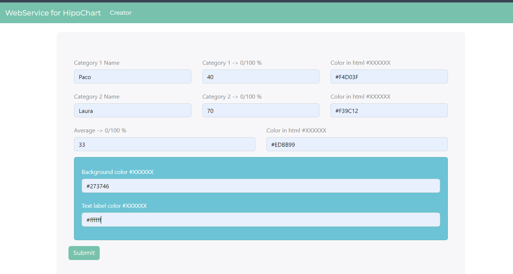
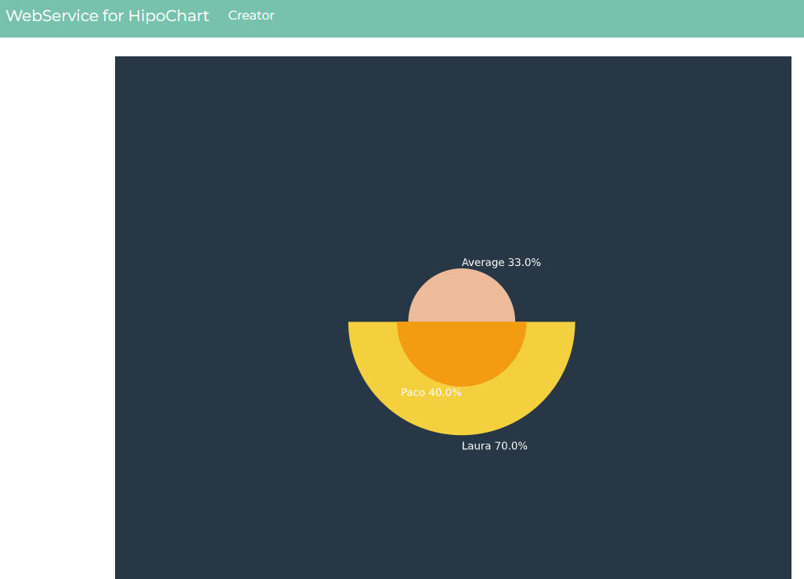

# HipoChart

Simple and little webservice to help to delivery helpdesk team to draw something that they called 'hipochart'.

Which is frequency chart with mean and 2 values, see screenshots below.

## Requirements
python
flask
matplotlib

## Images

